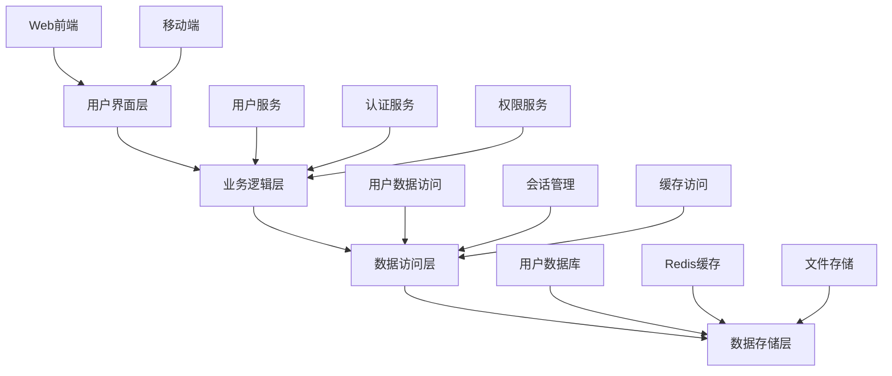
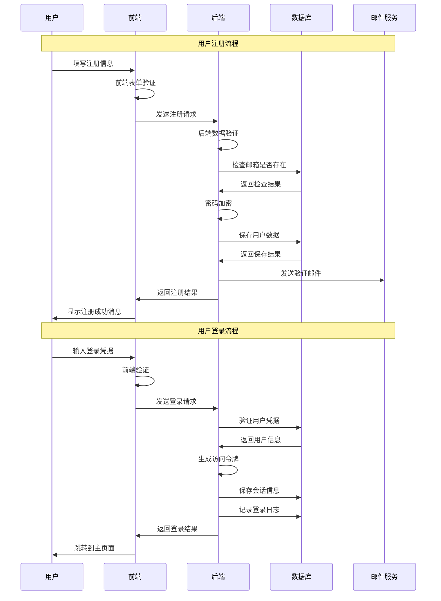
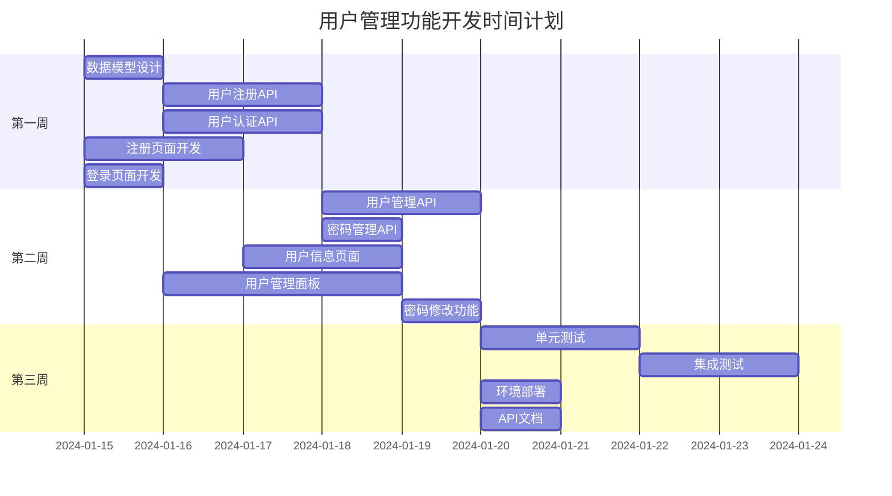

# 用户管理功能规格

> 📋 **使用说明**: 这是用户管理功能开发的规格文档，包含完整的需求分析、设计方案和实现计划。

## 基本信息

- **功能名称**: 用户管理系统
- **创建日期**: 2024-01-15
- **负责人**: 开发团队
- **优先级**: 高
- **预估工期**: 2 周
- **当前状态**: 需求分析

## 需求分析 (Requirements)

### 📋 **功能概述**
用户管理功能是系统的核心模块，提供完整的用户生命周期管理，包括用户注册、登录、信息维护、权限管理等功能。该功能旨在为系统提供安全、可靠的用户身份认证和授权机制。

### 👥 **目标用户**
- **主要用户**: 系统管理员 - 负责用户账户的创建、管理和维护
- **次要用户**: 普通用户 - 使用系统服务，管理个人账户信息
- **用户画像**: 具备基本计算机操作能力，需要简单直观的用户界面

### 📖 **用户故事**

#### 故事 1: 用户注册
**作为** 新用户  
**我希望** 能够创建账户并注册系统  
**以便** 使用系统提供的各项服务

**验收标准**:
- [ ] 用户可以通过邮箱和密码注册账户
- [ ] 系统验证邮箱格式和密码强度
- [ ] 注册成功后自动发送确认邮件
- [ ] 重复邮箱注册时显示友好提示

**优先级**: 高

#### 故事 2: 用户登录
**作为** 已注册用户  
**我希望** 能够安全地登录系统  
**以便** 访问我的个人账户和使用系统功能

**验收标准**:
- [ ] 用户可以使用邮箱和密码登录
- [ ] 登录失败时显示明确的错误信息
- [ ] 支持"记住我"功能
- [ ] 连续登录失败后实施账户保护机制

**优先级**: 高

#### 故事 3: 用户信息管理
**作为** 登录用户  
**我希望** 能够查看和修改个人信息  
**以便** 保持账户信息的准确性

**验收标准**:
- [ ] 用户可以查看个人基本信息
- [ ] 用户可以修改姓名、头像等非敏感信息
- [ ] 修改邮箱需要验证新邮箱
- [ ] 修改密码需要验证原密码

**优先级**: 中

#### 故事 4: 用户权限管理
**作为** 系统管理员  
**我希望** 能够管理用户权限和角色  
**以便** 控制用户对系统功能的访问

**验收标准**:
- [ ] 管理员可以查看所有用户列表
- [ ] 管理员可以分配和修改用户角色
- [ ] 管理员可以启用或禁用用户账户
- [ ] 权限变更立即生效

**优先级**: 高

### 🎯 **功能需求**

#### 核心功能
1. **用户注册**: 邮箱注册、密码设置、邮箱验证
2. **用户登录**: 身份验证、会话管理、安全控制
3. **用户信息管理**: 个人资料维护、密码修改、头像上传
4. **权限管理**: 角色分配、权限控制、访问管理
5. **用户列表**: 用户查询、筛选、批量操作

#### 辅助功能
1. **密码重置**: 忘记密码时的重置流程
2. **登录日志**: 记录用户登录行为
3. **账户安全**: 异常登录检测和通知

### 📊 **非功能性需求**

#### 性能需求
- **响应时间**: 登录响应时间 < 500ms，查询响应时间 < 200ms
- **并发用户**: 支持 1000+ 并发用户同时在线
- **数据处理**: 支持 10万+ 用户数据管理

#### 可用性需求
- **系统可用性**: 99.9% 可用性保证
- **用户界面**: 响应式设计，支持移动端访问
- **易用性**: 新用户 5 分钟内完成注册和基本操作

#### 安全需求
- **数据安全**: 密码加密存储，敏感信息传输加密
- **访问控制**: 基于角色的权限控制(RBAC)
- **隐私保护**: 符合数据保护法规，用户数据脱敏

#### 兼容性需求
- **浏览器兼容**: 支持 Chrome 90+, Firefox 88+, Safari 14+
- **设备兼容**: 支持桌面端和移动端设备
- **系统兼容**: 跨平台部署支持

### 🔗 **依赖关系**
- **前置条件**: 数据库系统已部署，邮件服务已配置
- **外部依赖**: SMTP 邮件服务、文件存储服务
- **技术依赖**: Web 框架、数据库 ORM、身份验证库

### 🚫 **约束条件**
- **技术约束**: 使用现有技术栈，避免引入新的重大依赖
- **时间约束**: 2 周内完成核心功能开发
- **资源约束**: 2-3 名开发人员参与开发
- **业务约束**: 必须符合数据保护和隐私法规要求

---

## 设计阶段 (Design)

### 🏗️ **系统架构**

#### 整体架构


#### 组件设计
- **前端组件**: 登录表单、注册表单、用户信息页面、用户管理面板
- **后端服务**: 用户管理服务、身份认证服务、权限控制服务
- **数据组件**: 用户数据模型、会话管理、权限数据模型

### 🔌 **接口设计**

#### API 接口
```typescript
// 用户管理 API 接口定义
interface UserAPI {
  // 用户注册
  register(userData: RegisterRequest): Promise<ApiResponse<User>>;
  
  // 用户登录
  login(credentials: LoginRequest): Promise<ApiResponse<LoginResponse>>;
  
  // 获取用户信息
  getUserById(id: string): Promise<ApiResponse<User>>;
  
  // 更新用户信息
  updateUser(id: string, updates: UpdateUserRequest): Promise<ApiResponse<User>>;
  
  // 删除用户
  deleteUser(id: string): Promise<ApiResponse<boolean>>;
  
  // 获取用户列表
  getUsers(params: GetUsersRequest): Promise<ApiResponse<UserListResponse>>;
  
  // 修改用户密码
  changePassword(id: string, passwordData: ChangePasswordRequest): Promise<ApiResponse<boolean>>;
  
  // 重置密码
  resetPassword(email: string): Promise<ApiResponse<boolean>>;
  
  // 用户权限管理
  updateUserRole(id: string, role: UserRole): Promise<ApiResponse<User>>;
}

// 数据类型定义
interface User {
  id: string;
  name: string;
  email: string;
  role: UserRole;
  avatar?: string;
  isActive: boolean;
  createdAt: Date;
  updatedAt: Date;
  lastLoginAt?: Date;
}

interface RegisterRequest {
  name: string;
  email: string;
  password: string;
}

interface LoginRequest {
  email: string;
  password: string;
  rememberMe?: boolean;
}

interface LoginResponse {
  user: User;
  token: string;
  expiresAt: Date;
}

interface UpdateUserRequest {
  name?: string;
  email?: string;
  avatar?: string;
}

interface ChangePasswordRequest {
  currentPassword: string;
  newPassword: string;
}

interface GetUsersRequest {
  page?: number;
  limit?: number;
  search?: string;
  role?: UserRole;
  isActive?: boolean;
}

interface UserListResponse {
  users: User[];
  total: number;
  page: number;
  limit: number;
}

type UserRole = 'admin' | 'user' | 'guest';

interface ApiResponse<T> {
  success: boolean;
  data?: T;
  error?: string;
  message?: string;
}
```

#### 数据库设计
```sql
-- 用户表设计
CREATE TABLE users (
  id VARCHAR(36) PRIMARY KEY,
  name VARCHAR(100) NOT NULL,
  email VARCHAR(255) UNIQUE NOT NULL,
  password_hash VARCHAR(255) NOT NULL,
  role ENUM('admin', 'user', 'guest') DEFAULT 'user',
  avatar VARCHAR(500),
  is_active BOOLEAN DEFAULT TRUE,
  email_verified BOOLEAN DEFAULT FALSE,
  created_at TIMESTAMP DEFAULT CURRENT_TIMESTAMP,
  updated_at TIMESTAMP DEFAULT CURRENT_TIMESTAMP ON UPDATE CURRENT_TIMESTAMP,
  last_login_at TIMESTAMP NULL,
  INDEX idx_email (email),
  INDEX idx_role (role),
  INDEX idx_active (is_active)
);

-- 用户会话表
CREATE TABLE user_sessions (
  id VARCHAR(36) PRIMARY KEY,
  user_id VARCHAR(36) NOT NULL,
  token_hash VARCHAR(255) NOT NULL,
  expires_at TIMESTAMP NOT NULL,
  created_at TIMESTAMP DEFAULT CURRENT_TIMESTAMP,
  FOREIGN KEY (user_id) REFERENCES users(id) ON DELETE CASCADE,
  INDEX idx_user_id (user_id),
  INDEX idx_token (token_hash),
  INDEX idx_expires (expires_at)
);

-- 登录日志表
CREATE TABLE login_logs (
  id BIGINT AUTO_INCREMENT PRIMARY KEY,
  user_id VARCHAR(36),
  email VARCHAR(255) NOT NULL,
  ip_address VARCHAR(45),
  user_agent TEXT,
  login_status ENUM('success', 'failed') NOT NULL,
  failure_reason VARCHAR(255),
  created_at TIMESTAMP DEFAULT CURRENT_TIMESTAMP,
  FOREIGN KEY (user_id) REFERENCES users(id) ON DELETE SET NULL,
  INDEX idx_user_id (user_id),
  INDEX idx_email (email),
  INDEX idx_status (login_status),
  INDEX idx_created_at (created_at)
);
```

### 🎨 **用户界面设计**

#### 页面结构
- **登录页面**: 简洁的登录表单，包含邮箱、密码输入框和"记住我"选项
- **注册页面**: 用户注册表单，包含姓名、邮箱、密码和确认密码
- **用户信息页面**: 显示和编辑个人信息，包含头像上传功能
- **用户管理页面**: 管理员专用，显示用户列表和管理操作
- **密码修改页面**: 安全的密码修改流程

#### 交互流程


### 🔧 **技术选型**

#### 前端技术栈
- **框架**: React 18+ 或 Vue 3+
- **状态管理**: Redux Toolkit 或 Pinia
- **UI 组件库**: Ant Design 或 Element Plus
- **构建工具**: Vite
- **HTTP 客户端**: Axios
- **表单验证**: Formik + Yup 或 VeeValidate

#### 后端技术栈
- **语言**: Node.js (TypeScript) 或 Python
- **框架**: Express.js 或 FastAPI
- **数据库**: MySQL 8.0+ 或 PostgreSQL 13+
- **缓存**: Redis 6+
- **身份验证**: JWT + bcrypt
- **ORM**: Prisma 或 SQLAlchemy

#### 开发工具
- **版本控制**: Git
- **包管理**: npm 或 yarn
- **测试框架**: Jest + Testing Library
- **API 文档**: Swagger/OpenAPI
- **部署工具**: Docker + Docker Compose

### ⚠️ **风险评估**

#### 技术风险
- **风险 1**: 密码安全性不足
  - **影响**: 用户账户可能被破解
  - **概率**: 中
  - **应对策略**: 使用强密码策略，实施密码复杂度要求，使用 bcrypt 加密

- **风险 2**: 会话管理漏洞
  - **影响**: 用户会话可能被劫持
  - **概率**: 中
  - **应对策略**: 使用安全的 JWT 实现，设置合理的过期时间，实施会话刷新机制

#### 业务风险
- **风险 1**: 用户数据泄露
  - **影响**: 法律风险和用户信任损失
  - **概率**: 低
  - **应对策略**: 实施数据加密，定期安全审计，遵循数据保护法规

- **风险 2**: 系统性能瓶颈
  - **影响**: 用户体验下降，系统不可用
  - **概率**: 中
  - **应对策略**: 实施缓存策略，数据库优化，负载均衡

---

## 任务分解 (Tasks)

### 📋 **任务列表**

#### 前端开发任务
- [ ] **T001**: 创建用户注册页面
  - **描述**: 实现用户注册表单，包含姓名、邮箱、密码输入和验证
  - **估算**: 8 小时
  - **依赖**: 无
  - **验收标准**: 表单验证正常，样式符合设计规范，成功提交后显示确认消息
  - **负责人**: 前端开发工程师

- [ ] **T002**: 创建用户登录页面
  - **描述**: 实现用户登录表单，包含邮箱、密码输入和"记住我"功能
  - **估算**: 6 小时
  - **依赖**: 无
  - **验收标准**: 登录验证正常，错误提示友好，支持记住登录状态
  - **负责人**: 前端开发工程师

- [ ] **T003**: 实现用户信息管理页面
  - **描述**: 用户个人信息展示和编辑功能，包含头像上传
  - **估算**: 12 小时
  - **依赖**: T001, T002
  - **验收标准**: 信息展示完整，编辑功能正常，头像上传成功
  - **负责人**: 前端开发工程师

- [ ] **T004**: 开发用户管理面板
  - **描述**: 管理员用户列表页面，支持搜索、筛选、批量操作
  - **估算**: 16 小时
  - **依赖**: T002
  - **验收标准**: 列表展示正常，搜索筛选功能完整，权限控制正确
  - **负责人**: 前端开发工程师

- [ ] **T005**: 实现密码修改功能
  - **描述**: 安全的密码修改流程，包含原密码验证
  - **估算**: 4 小时
  - **依赖**: T003
  - **验收标准**: 密码验证安全，修改流程顺畅，成功后强制重新登录
  - **负责人**: 前端开发工程师

#### 后端开发任务
- [ ] **T006**: 设计和实现用户数据模型
  - **描述**: 创建用户相关数据库表和模型定义
  - **估算**: 6 小时
  - **依赖**: 无
  - **验收标准**: 数据库表结构正确，模型关系完整，索引优化合理
  - **负责人**: 后端开发工程师

- [ ] **T007**: 实现用户注册 API
  - **描述**: 用户注册接口，包含数据验证、密码加密、邮件发送
  - **估算**: 8 小时
  - **依赖**: T006
  - **验收标准**: 接口功能完整，数据验证严格，邮件发送正常
  - **负责人**: 后端开发工程师

- [ ] **T008**: 实现用户认证 API
  - **描述**: 用户登录、登出、令牌验证等认证相关接口
  - **估算**: 10 小时
  - **依赖**: T006
  - **验收标准**: 认证流程安全，令牌管理正确，会话控制有效
  - **负责人**: 后端开发工程师

- [ ] **T009**: 实现用户管理 API
  - **描述**: 用户信息 CRUD 操作，包含权限控制
  - **估算**: 12 小时
  - **依赖**: T008
  - **验收标准**: CRUD 操作完整，权限控制严格，数据安全可靠
  - **负责人**: 后端开发工程师

- [ ] **T010**: 实现密码管理 API
  - **描述**: 密码修改、重置等功能接口
  - **估算**: 6 小时
  - **依赖**: T008
  - **验收标准**: 密码操作安全，验证流程完整，邮件通知正常
  - **负责人**: 后端开发工程师

#### 测试任务
- [ ] **T011**: 编写单元测试
  - **描述**: 为核心业务逻辑编写单元测试用例
  - **估算**: 16 小时
  - **依赖**: T007, T008, T009, T010
  - **验收标准**: 测试覆盖率 > 80%，所有测试用例通过
  - **负责人**: 测试工程师

- [ ] **T012**: 集成测试和端到端测试
  - **描述**: API 集成测试和前后端联调测试
  - **估算**: 12 小时
  - **依赖**: T001-T010
  - **验收标准**: 所有功能流程测试通过，性能指标达标
  - **负责人**: 测试工程师

#### 部署和文档任务
- [ ] **T013**: 配置开发和生产环境
  - **描述**: Docker 容器化部署，环境配置管理
  - **估算**: 8 小时
  - **依赖**: T006-T010
  - **验收标准**: 环境部署成功，配置管理规范，监控告警正常
  - **负责人**: DevOps 工程师

- [ ] **T014**: 编写 API 文档
  - **描述**: 使用 Swagger 生成完整的 API 文档
  - **估算**: 4 小时
  - **依赖**: T007-T010
  - **验收标准**: 文档完整准确，示例清晰，便于前端对接
  - **负责人**: 后端开发工程师

### 📊 **任务优先级**

#### 高优先级 (P0) - 核心功能
- T006, T007, T008 - 用户注册和认证基础
- T001, T002 - 基础用户界面

#### 中优先级 (P1) - 重要功能
- T009, T003, T004 - 用户管理功能
- T010, T005 - 密码管理功能

#### 低优先级 (P2) - 支持功能
- T011, T012 - 测试和质量保证
- T013, T014 - 部署和文档

### 📅 **时间计划**



### 📈 **工作量估算**

| 任务类别 | 任务数量 | 总工时 | 平均工时 |
|---------|---------|--------|----------|
| 前端开发 | 5 | 46h | 9.2h |
| 后端开发 | 5 | 42h | 8.4h |
| 测试 | 2 | 28h | 14h |
| 部署文档 | 2 | 12h | 6h |
| **总计** | **14** | **128h** | **9.1h** |

**团队配置建议**:
- 前端开发工程师: 1 名
- 后端开发工程师: 1 名  
- 测试工程师: 1 名
- DevOps 工程师: 0.5 名

**预计完成时间**: 3 周 (按每人每天 8 小时计算)

---

## 实现阶段 (Implementation)

### 💻 **开发记录**

*此部分将在开发过程中实时更新*

#### 任务进度跟踪
- **已完成任务**: 0/14
- **进行中任务**: 0/14  
- **待开始任务**: 14/14
- **整体进度**: 0%

#### 开发环境准备
- [ ] 开发环境搭建
- [ ] 代码仓库初始化
- [ ] CI/CD 流水线配置
- [ ] 开发规范制定

### 🧪 **测试计划**

#### 测试策略
- **单元测试**: 覆盖所有核心业务逻辑，目标覆盖率 80%+
- **集成测试**: 测试 API 接口和数据库交互
- **端到端测试**: 测试完整的用户操作流程
- **性能测试**: 验证系统在预期负载下的性能表现
- **安全测试**: 验证身份认证和数据安全机制

#### 测试环境
- **单元测试环境**: 本地开发环境
- **集成测试环境**: 独立的测试服务器
- **性能测试环境**: 模拟生产环境的测试集群

### 📋 **部署计划**

#### 部署策略
- **开发环境**: 本地 Docker 容器
- **测试环境**: 云服务器部署，用于集成测试
- **预生产环境**: 与生产环境配置一致的验证环境
- **生产环境**: 高可用集群部署

#### 发布流程
1. 代码审查和合并
2. 自动化测试验证
3. 测试环境部署验证
4. 预生产环境验证
5. 生产环境灰度发布
6. 全量发布和监控

---

## 验收和总结

### ✅ **验收检查**

#### 功能验收
- [ ] 所有用户故事都已实现
- [ ] 验收标准都已满足
- [ ] 功能测试全部通过
- [ ] 用户体验符合设计要求

#### 质量验收
- [ ] 代码审查已完成
- [ ] 测试覆盖率达标 (>80%)
- [ ] 性能指标满足要求
- [ ] 安全检查通过
- [ ] 无严重和高危漏洞

#### 文档验收
- [ ] API 文档完整准确
- [ ] 用户操作手册完整
- [ ] 部署运维文档完整
- [ ] 代码注释规范完整

### 📊 **项目总结**

*此部分将在项目完成后填写*

#### 完成情况
- **计划工时**: 128 小时
- **实际工时**: 待统计
- **工时偏差**: 待计算
- **完成质量**: 待评估

#### 经验教训
**做得好的地方**:
- 待总结

**需要改进的地方**:
- 待总结

#### 后续计划
- **优化计划**: 性能优化、用户体验改进
- **扩展计划**: 第三方登录、多因子认证
- **维护计划**: 定期安全更新、功能迭代

---

## 附录

### 📚 **参考资料**
- [OWASP 身份认证指南](https://owasp.org/www-project-authentication-cheat-sheet/)
- [JWT 最佳实践](https://tools.ietf.org/html/rfc7519)
- [密码安全存储指南](https://cheatsheetseries.owasp.org/cheatsheets/Password_Storage_Cheat_Sheet.html)
- [GDPR 数据保护法规](https://gdpr.eu/)

### 🔗 **相关链接**
- **项目仓库**: 待创建
- **API 文档**: 待生成
- **测试报告**: 待生成
- **部署文档**: 待编写

### 📞 **联系信息**
- **项目负责人**: 待指定
- **技术负责人**: 待指定
- **产品负责人**: 待指定

---

> 📝 **文档说明**: 
> - 本文档遵循项目规范模板创建
> - 请在开发过程中及时更新进度和状态
> - 所有时间估算基于团队经验，实际执行时可能需要调整
> - 确保所有安全要求得到严格执行