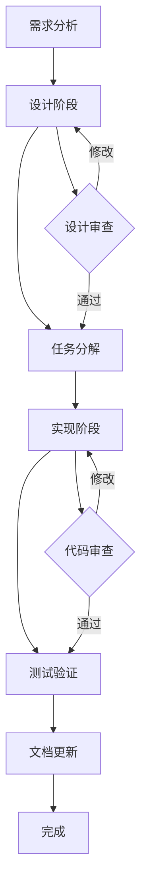
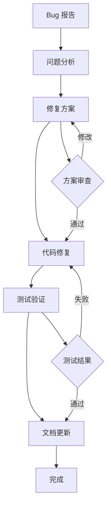
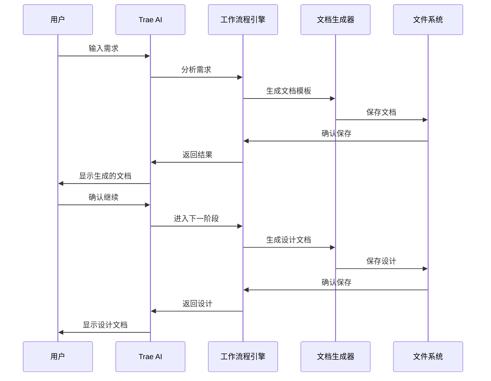

# 技术架构：Trae AI 工作流程系统

## 架构概览

### 🏗️ **整体架构设计**
```
┌─────────────────────────────────────────────────────────────┐
│                    Trae AI 工作流程系统                      │
├─────────────────────────────────────────────────────────────┤
│  用户界面层 (UI Layer)                                       │
│  ├── Trae AI 交互界面                                       │
│  ├── 项目管理面板                                           │
│  └── 文档预览和编辑                                         │
├─────────────────────────────────────────────────────────────┤
│  业务逻辑层 (Business Logic Layer)                          │
│  ├── 工作流程引擎                                           │
│  ├── 任务管理器                                             │
│  ├── 文档生成器                                             │
│  └── AI 集成服务                                            │
├─────────────────────────────────────────────────────────────┤
│  数据访问层 (Data Access Layer)                             │
│  ├── 文件系统管理                                           │
│  ├── 配置管理                                               │
│  ├── 模板引擎                                               │
│  └── 版本控制集成                                           │
├─────────────────────────────────────────────────────────────┤
│  基础设施层 (Infrastructure Layer)                          │
│  ├── Trae AI 核心                                          │
│  ├── 文件系统                                               │
│  ├── 网络通信                                               │
│  └── 安全认证                                               │
└─────────────────────────────────────────────────────────────┘
```

## 核心技术栈

### 🤖 **AI 集成技术**
- **Trae AI 核心**：主要的 AI 推理引擎
- **上下文管理**：智能上下文感知和优化
- **自然语言处理**：需求理解和代码生成
- **智能建议系统**：基于项目历史的智能建议

### 📁 **文件系统架构**
```
.trae/
├── steering/           # 项目指导文档
│   ├── product.md      # 产品愿景
│   ├── tech.md         # 技术架构
│   └── structure.md    # 项目结构
├── specs/              # 功能规格
│   └── [feature-name]/
│       ├── requirements.md
│       ├── design.md
│       ├── tasks.md
│       └── implementation.md
├── bugs/               # Bug 管理
│   └── [bug-id]/
│       ├── report.md
│       ├── analysis.md
│       ├── fix.md
│       └── verification.md
├── templates/          # 模板文件
│   ├── spec-template.md
│   ├── bug-template.md
│   └── task-template.md
├── workflows/          # 工作流程定义
│   ├── spec-workflow.md
│   ├── bug-workflow.md
│   └── refactor-workflow.md
├── guides/             # 使用指南
│   ├── getting-started.md
│   ├── best-practices.md
│   └── troubleshooting.md
└── trae-config.json    # 配置文件
```

## 核心组件设计

### 🔄 **工作流程引擎**

#### 规格工作流程 (Spec Workflow)


#### Bug 修复工作流程 (Bug Workflow)


### 📊 **任务管理系统**

#### 任务状态管理
```typescript
interface Task {
  id: string;
  title: string;
  description: string;
  status: 'pending' | 'in_progress' | 'completed' | 'blocked';
  priority: 'low' | 'medium' | 'high' | 'critical';
  assignee?: string;
  dependencies: string[];
  estimatedHours: number;
  actualHours?: number;
  createdAt: Date;
  updatedAt: Date;
  completedAt?: Date;
}

interface TaskManager {
  createTask(task: Omit<Task, 'id' | 'createdAt' | 'updatedAt'>): Task;
  updateTask(id: string, updates: Partial<Task>): Task;
  deleteTask(id: string): boolean;
  getTasks(filter?: TaskFilter): Task[];
  getTaskById(id: string): Task | null;
  getTaskDependencies(id: string): Task[];
  validateTaskDependencies(task: Task): boolean;
}
```

### 🎯 **AI 集成服务**

#### Trae AI 接口设计
```typescript
interface TraeAIService {
  // 需求分析
  analyzeRequirements(input: string): Promise<RequirementAnalysis>;
  
  // 设计建议
  generateDesign(requirements: Requirements): Promise<DesignSuggestion>;
  
  // 任务分解
  breakdownTasks(design: Design): Promise<Task[]>;
  
  // 代码生成
  generateCode(task: Task): Promise<CodeSuggestion>;
  
  // 代码审查
  reviewCode(code: string): Promise<CodeReview>;
  
  // Bug 分析
  analyzeBug(bugReport: BugReport): Promise<BugAnalysis>;
  
  // 修复建议
  suggestFix(bugAnalysis: BugAnalysis): Promise<FixSuggestion>;
}
```

### 📝 **文档生成系统**

#### 模板引擎
```typescript
interface TemplateEngine {
  loadTemplate(templateName: string): Template;
  renderTemplate(template: Template, data: any): string;
  validateTemplate(template: Template): ValidationResult;
  registerHelper(name: string, helper: Function): void;
}

interface DocumentGenerator {
  generateRequirements(input: RequirementInput): string;
  generateDesign(requirements: Requirements): string;
  generateTasks(design: Design): string;
  generateImplementation(tasks: Task[]): string;
  generateBugReport(bugInput: BugInput): string;
  generateAnalysis(bugReport: BugReport): string;
}
```

## 数据流设计

### 📈 **信息流架构**


### 🔄 **状态管理**
```typescript
interface WorkflowState {
  currentPhase: WorkflowPhase;
  completedPhases: WorkflowPhase[];
  pendingTasks: Task[];
  completedTasks: Task[];
  blockedTasks: Task[];
  projectMetadata: ProjectMetadata;
}

interface StateManager {
  getCurrentState(): WorkflowState;
  updateState(updates: Partial<WorkflowState>): void;
  saveState(): Promise<void>;
  loadState(): Promise<WorkflowState>;
  resetState(): void;
}
```

## 性能优化策略

### ⚡ **响应性能优化**
- **懒加载**：按需加载文档和模板
- **缓存机制**：智能缓存 AI 响应和文档内容
- **增量更新**：只更新变化的部分
- **并行处理**：并行执行独立的任务

### 💾 **内存管理**
- **对象池**：重用常用对象
- **垃圾回收**：及时清理不需要的资源
- **流式处理**：大文件的流式读写
- **压缩存储**：压缩存储大型文档

### 🔧 **可扩展性设计**
- **插件架构**：支持自定义工作流程和模板
- **API 接口**：提供标准的扩展接口
- **配置驱动**：通过配置文件自定义行为
- **模块化设计**：独立的功能模块

## 安全性考虑

### 🔒 **数据安全**
- **本地优先**：敏感数据优先存储在本地
- **加密存储**：重要配置和数据加密存储
- **访问控制**：基于角色的访问控制
- **审计日志**：完整的操作审计日志

### 🛡️ **代码安全**
- **输入验证**：严格的输入验证和清理
- **依赖管理**：定期更新和安全扫描
- **错误处理**：安全的错误处理机制
- **最小权限**：最小权限原则

## 监控和诊断

### 📊 **性能监控**
- **响应时间**：AI 响应和文档生成时间
- **资源使用**：内存和 CPU 使用情况
- **错误率**：系统错误和异常统计
- **用户行为**：用户操作模式分析

### 🔍 **诊断工具**
- **日志系统**：结构化的日志记录
- **调试模式**：详细的调试信息
- **健康检查**：系统组件健康状态
- **性能分析**：性能瓶颈分析工具

## 部署和运维

### 🚀 **部署策略**
- **本地部署**：完全本地化的部署方案
- **云端集成**：可选的云端服务集成
- **容器化**：Docker 容器化部署
- **自动化部署**：CI/CD 自动化流程

### 🔧 **运维管理**
- **配置管理**：集中化的配置管理
- **版本控制**：完整的版本控制和回滚
- **备份恢复**：自动化的备份和恢复
- **更新机制**：安全的自动更新机制