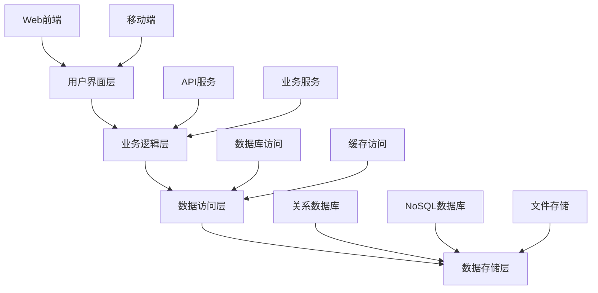
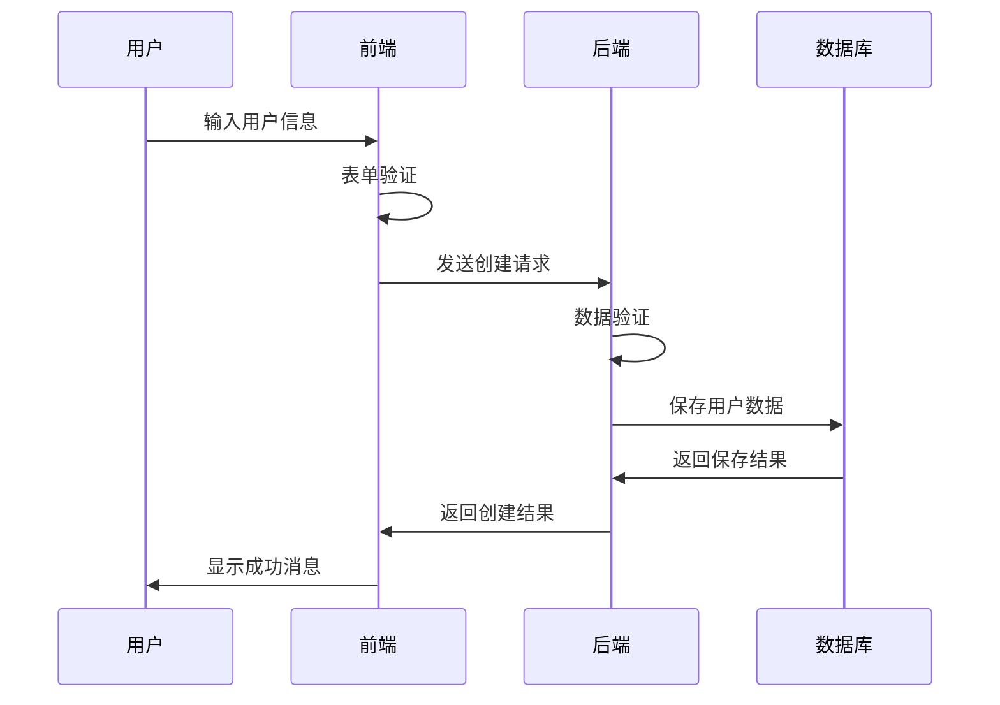
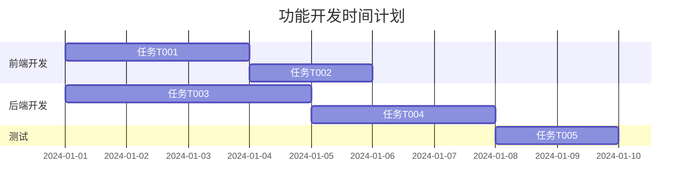

# 功能规格模板

> 📋 **使用说明**: 这是功能开发的标准模板，请根据实际情况填写各个部分。删除不适用的部分，保留相关内容。

## 基本信息

- **功能名称**: [功能的简短名称]
- **创建日期**: [YYYY-MM-DD]
- **负责人**: [开发负责人]
- **优先级**: [高/中/低]
- **预估工期**: [X 天/周]
- **当前状态**: [需求分析/设计/开发/测试/完成]

## 需求分析 (Requirements)

### 📋 **功能概述**
[简要描述这个功能的目的和价值]

### 👥 **目标用户**
- **主要用户**: [描述主要用户群体]
- **次要用户**: [描述次要用户群体]
- **用户画像**: [用户的特征和需求]

### 📖 **用户故事**

#### 故事 1: [故事标题]
**作为** [用户角色]  
**我希望** [功能描述]  
**以便** [价值说明]

**验收标准**:
- [ ] [具体的验收条件 1]
- [ ] [具体的验收条件 2]
- [ ] [具体的验收条件 3]

**优先级**: [高/中/低]

#### 故事 2: [故事标题]
**作为** [用户角色]  
**我希望** [功能描述]  
**以便** [价值说明]

**验收标准**:
- [ ] [具体的验收条件 1]
- [ ] [具体的验收条件 2]
- [ ] [具体的验收条件 3]

**优先级**: [高/中/低]

### 🎯 **功能需求**

#### 核心功能
1. **[功能点 1]**: [详细描述]
2. **[功能点 2]**: [详细描述]
3. **[功能点 3]**: [详细描述]

#### 辅助功能
1. **[辅助功能 1]**: [详细描述]
2. **[辅助功能 2]**: [详细描述]

### 📊 **非功能性需求**

#### 性能需求
- **响应时间**: [具体指标，如 < 200ms]
- **并发用户**: [支持的并发用户数]
- **数据处理**: [数据处理能力要求]

#### 可用性需求
- **系统可用性**: [如 99.9% 可用性]
- **用户界面**: [界面友好性要求]
- **易用性**: [学习成本和使用难度]

#### 安全需求
- **数据安全**: [数据保护要求]
- **访问控制**: [权限管理要求]
- **隐私保护**: [用户隐私保护]

#### 兼容性需求
- **浏览器兼容**: [支持的浏览器版本]
- **设备兼容**: [支持的设备类型]
- **系统兼容**: [操作系统要求]

### 🔗 **依赖关系**
- **前置条件**: [需要先完成的功能或条件]
- **外部依赖**: [依赖的外部系统或服务]
- **技术依赖**: [依赖的技术栈或工具]

### 🚫 **约束条件**
- **技术约束**: [技术栈限制]
- **时间约束**: [交付时间要求]
- **资源约束**: [人力和预算限制]
- **业务约束**: [业务规则限制]

---

## 设计阶段 (Design)

### 🏗️ **系统架构**

#### 整体架构


#### 组件设计
- **前端组件**: [列出主要的前端组件]
- **后端服务**: [列出主要的后端服务]
- **数据组件**: [列出数据相关组件]

### 🔌 **接口设计**

#### API 接口
```typescript
// 示例 API 接口定义
interface UserAPI {
  // 创建用户
  createUser(userData: CreateUserRequest): Promise<ApiResponse<User>>;
  
  // 获取用户信息
  getUserById(id: string): Promise<ApiResponse<User>>;
  
  // 更新用户信息
  updateUser(id: string, updates: UpdateUserRequest): Promise<ApiResponse<User>>;
  
  // 删除用户
  deleteUser(id: string): Promise<ApiResponse<boolean>>;
}

// 数据类型定义
interface User {
  id: string;
  name: string;
  email: string;
  role: UserRole;
  createdAt: Date;
  updatedAt: Date;
}

interface CreateUserRequest {
  name: string;
  email: string;
  password: string;
  role?: UserRole;
}

interface UpdateUserRequest {
  name?: string;
  email?: string;
  role?: UserRole;
}

type UserRole = 'admin' | 'user' | 'guest';

interface ApiResponse<T> {
  success: boolean;
  data?: T;
  error?: string;
  message?: string;
}
```

#### 数据库设计
```sql
-- 示例数据库表设计
CREATE TABLE users (
  id VARCHAR(36) PRIMARY KEY,
  name VARCHAR(100) NOT NULL,
  email VARCHAR(255) UNIQUE NOT NULL,
  password_hash VARCHAR(255) NOT NULL,
  role ENUM('admin', 'user', 'guest') DEFAULT 'user',
  created_at TIMESTAMP DEFAULT CURRENT_TIMESTAMP,
  updated_at TIMESTAMP DEFAULT CURRENT_TIMESTAMP ON UPDATE CURRENT_TIMESTAMP,
  INDEX idx_email (email),
  INDEX idx_role (role)
);
```

### 🎨 **用户界面设计**

#### 页面结构
- **主页面**: [描述主要页面的布局和功能]
- **子页面**: [描述子页面的结构]
- **弹窗/模态框**: [描述交互组件]

#### 交互流程


### 🔧 **技术选型**

#### 前端技术栈
- **框架**: [React/Vue/Angular]
- **状态管理**: [Redux/Vuex/NgRx]
- **UI 组件库**: [Ant Design/Material-UI/Element]
- **构建工具**: [Webpack/Vite/Parcel]

#### 后端技术栈
- **语言**: [Node.js/Python/Java/Go]
- **框架**: [Express/FastAPI/Spring Boot/Gin]
- **数据库**: [MySQL/PostgreSQL/MongoDB]
- **缓存**: [Redis/Memcached]

#### 开发工具
- **版本控制**: [Git]
- **包管理**: [npm/yarn/pip/maven]
- **测试框架**: [Jest/Pytest/JUnit]
- **部署工具**: [Docker/Kubernetes]

### ⚠️ **风险评估**

#### 技术风险
- **风险 1**: [描述技术风险]
  - **影响**: [风险影响]
  - **概率**: [高/中/低]
  - **应对策略**: [应对方案]

#### 业务风险
- **风险 1**: [描述业务风险]
  - **影响**: [风险影响]
  - **概率**: [高/中/低]
  - **应对策略**: [应对方案]

---

## 任务分解 (Tasks)

### 📋 **任务列表**

#### 前端开发任务
- [ ] **T001**: [任务名称]
  - **描述**: [详细描述任务内容]
  - **估算**: [X 小时]
  - **依赖**: [依赖的其他任务]
  - **验收标准**: [具体的完成标准]
  - **负责人**: [任务负责人]

- [ ] **T002**: [任务名称]
  - **描述**: [详细描述任务内容]
  - **估算**: [X 小时]
  - **依赖**: [依赖的其他任务]
  - **验收标准**: [具体的完成标准]
  - **负责人**: [任务负责人]

#### 后端开发任务
- [ ] **T003**: [任务名称]
  - **描述**: [详细描述任务内容]
  - **估算**: [X 小时]
  - **依赖**: [依赖的其他任务]
  - **验收标准**: [具体的完成标准]
  - **负责人**: [任务负责人]

- [ ] **T004**: [任务名称]
  - **描述**: [详细描述任务内容]
  - **估算**: [X 小时]
  - **依赖**: [依赖的其他任务]
  - **验收标准**: [具体的完成标准]
  - **负责人**: [任务负责人]

#### 测试任务
- [ ] **T005**: [任务名称]
  - **描述**: [详细描述任务内容]
  - **估算**: [X 小时]
  - **依赖**: [依赖的其他任务]
  - **验收标准**: [具体的完成标准]
  - **负责人**: [任务负责人]

### 📊 **任务优先级**

#### 高优先级 (P0)
- T001, T003 - 核心功能实现

#### 中优先级 (P1)
- T002, T004 - 重要功能实现

#### 低优先级 (P2)
- T005 - 优化和增强功能

### 📅 **时间计划**



### 📈 **工作量估算**

| 任务类别 | 任务数量 | 总工时 | 平均工时 |
|---------|---------|--------|----------|
| 前端开发 | 2 | 40h | 20h |
| 后端开发 | 2 | 56h | 28h |
| 测试 | 1 | 16h | 16h |
| **总计** | **5** | **112h** | **22.4h** |

---

## 实现阶段 (Implementation)

### 💻 **开发记录**

#### 任务 T001: [任务名称]
- **状态**: [进行中/已完成/已阻塞]
- **开始时间**: [YYYY-MM-DD HH:MM]
- **完成时间**: [YYYY-MM-DD HH:MM]
- **实际工时**: [X 小时]
- **负责人**: [开发人员]

**实现要点**:
- [关键实现点 1]
- [关键实现点 2]
- [关键实现点 3]

**遇到的问题**:
- [问题描述 1]
- [问题描述 2]

**解决方案**:
- [解决方案 1]
- [解决方案 2]

**代码变更**:
- 新增文件: [文件列表]
- 修改文件: [文件列表]
- 删除文件: [文件列表]

### 🧪 **测试结果**

#### 单元测试
- **测试覆盖率**: [X%]
- **通过率**: [X%]
- **失败用例**: [失败的测试用例]

#### 集成测试
- **API 测试**: [通过/失败]
- **数据库测试**: [通过/失败]
- **端到端测试**: [通过/失败]

#### 性能测试
- **响应时间**: [平均响应时间]
- **并发处理**: [支持的并发数]
- **资源使用**: [CPU/内存使用情况]

### 📋 **部署记录**

#### 测试环境部署
- **部署时间**: [YYYY-MM-DD HH:MM]
- **部署版本**: [版本号]
- **部署状态**: [成功/失败]
- **访问地址**: [测试环境URL]

#### 生产环境部署
- **部署时间**: [YYYY-MM-DD HH:MM]
- **部署版本**: [版本号]
- **部署状态**: [成功/失败]
- **访问地址**: [生产环境URL]

### 📝 **文档更新**
- [ ] API 文档已更新
- [ ] 用户手册已更新
- [ ] 技术文档已更新
- [ ] 部署文档已更新

---

## 验收和总结

### ✅ **验收检查**

#### 功能验收
- [ ] 所有用户故事都已实现
- [ ] 验收标准都已满足
- [ ] 功能测试全部通过

#### 质量验收
- [ ] 代码审查已完成
- [ ] 测试覆盖率达标
- [ ] 性能指标满足要求
- [ ] 安全检查通过

#### 文档验收
- [ ] 技术文档完整
- [ ] 用户文档完整
- [ ] 部署文档完整

### 📊 **项目总结**

#### 完成情况
- **计划工时**: [X 小时]
- **实际工时**: [X 小时]
- **工时偏差**: [±X%]
- **完成质量**: [优秀/良好/一般]

#### 经验教训
**做得好的地方**:
- [经验 1]
- [经验 2]
- [经验 3]

**需要改进的地方**:
- [改进点 1]
- [改进点 2]
- [改进点 3]

#### 后续计划
- **优化计划**: [后续优化内容]
- **扩展计划**: [功能扩展计划]
- **维护计划**: [维护和支持计划]

---

## 附录

### 📚 **参考资料**
- [相关文档链接 1]
- [相关文档链接 2]
- [技术参考资料]

### 🔗 **相关链接**
- **项目仓库**: [Git 仓库地址]
- **部署地址**: [生产环境地址]
- **监控面板**: [监控系统地址]
- **文档站点**: [文档网站地址]

### 📞 **联系信息**
- **项目负责人**: [姓名] - [邮箱]
- **技术负责人**: [姓名] - [邮箱]
- **产品负责人**: [姓名] - [邮箱]

---

> 📝 **模板说明**: 
> - 请根据实际项目情况调整模板内容
> - 删除不适用的部分，保留相关内容
> - 及时更新文档状态和进度
> - 确保所有链接和联系信息的准确性