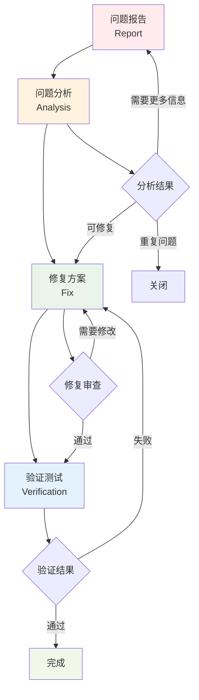

# Bug 修复工作流程：Trae AI 问题解决

## 工作流程概览

### 🐛 **四阶段修复流程**


## 阶段一：问题报告 (Report)

### 📋 **目标**
- 准确描述问题现象和影响
- 提供完整的重现步骤
- 收集相关的环境和日志信息

### 📝 **输入**
- 用户反馈或系统监控告警
- 错误日志和堆栈信息
- 环境配置信息

### 📄 **输出**
- `report.md` 文件
- 问题描述和分类
- 重现步骤
- 环境信息

### 🔄 **执行步骤**

#### 1. 创建 Bug 目录
```bash
# 创建 Bug 目录（使用序号和简短描述）
mkdir .trae/bugs/bug-001-login-failure

# 复制 Bug 报告模板
cp .trae/templates/bug-template.md .trae/bugs/bug-001-login-failure/report.md
```

#### 2. 问题信息收集
```markdown
## 问题基本信息

- **Bug ID**: bug-001-login-failure
- **报告时间**: 2024-01-15 14:30:00
- **报告人**: 张三 (zhangsan@example.com)
- **严重程度**: 高 (影响用户登录)
- **优先级**: P0 (紧急修复)
- **影响范围**: 所有用户

## 问题描述

### 现象
用户在登录页面输入正确的用户名和密码后，点击登录按钮，页面显示"登录失败"错误信息，无法正常登录系统。

### 预期行为
用户输入正确凭据后应该能够成功登录并跳转到主页面。

### 实际行为
- 登录按钮点击后页面显示"登录失败"
- 控制台显示 401 错误
- 用户无法进入系统
```

#### 3. 重现步骤记录
```markdown
## 重现步骤

### 前置条件
- 用户账号存在且状态正常
- 浏览器支持 JavaScript
- 网络连接正常

### 操作步骤
1. 打开浏览器，访问登录页面 (https://example.com/login)
2. 在用户名输入框输入: test@example.com
3. 在密码输入框输入: password123
4. 点击"登录"按钮
5. 观察页面反应

### 预期结果
- 页面跳转到主页面 (https://example.com/dashboard)
- 显示用户欢迎信息

### 实际结果
- 页面显示红色错误提示:"登录失败，请检查用户名和密码"
- 页面停留在登录页面
- 浏览器控制台显示 401 错误
```

#### 4. 环境信息收集
```markdown
## 环境信息

### 客户端环境
- **操作系统**: Windows 10 Pro 21H2
- **浏览器**: Chrome 120.0.6099.109
- **屏幕分辨率**: 1920x1080
- **网络**: 有线网络，100Mbps

### 服务器环境
- **服务器**: AWS EC2 t3.medium
- **操作系统**: Ubuntu 20.04 LTS
- **Node.js 版本**: 18.17.0
- **数据库**: MySQL 8.0.33
- **负载均衡**: AWS ALB

### 相关日志
```bash
# 应用日志
2024-01-15 14:30:15 ERROR [AuthController] Login failed for user: test@example.com
2024-01-15 14:30:15 ERROR [AuthService] Invalid credentials provided

# 数据库日志
2024-01-15 14:30:15 [Warning] Access denied for user 'app_user'@'10.0.1.100'
```

#### 5. 影响评估
```markdown
## 影响评估

### 用户影响
- **影响用户数**: 约 1000+ 活跃用户
- **业务影响**: 用户无法登录，影响正常业务操作
- **时间影响**: 问题持续时间约 2 小时

### 系统影响
- **功能影响**: 登录功能完全不可用
- **数据影响**: 无数据丢失风险
- **性能影响**: 服务器负载正常

### 紧急程度
- **严重程度**: 高 (核心功能不可用)
- **紧急程度**: 紧急 (需要立即修复)
- **修复时限**: 4 小时内
```

### ✅ **完成标准**
- [ ] 问题描述清晰准确
- [ ] 重现步骤完整可操作
- [ ] 环境信息收集完整
- [ ] 影响评估准确
- [ ] 相关日志和截图已收集

## 阶段二：问题分析 (Analysis)

### 🔍 **目标**
- 定位问题的根本原因
- 分析问题的技术细节
- 评估修复的复杂度和风险

### 📝 **输入**
- 完整的问题报告
- 系统日志和监控数据
- 相关代码和配置

### 📄 **输出**
- `analysis.md` 文件
- 根因分析结果
- 技术分析报告
- 修复建议

### 🔄 **执行步骤**

#### 1. 初步分析
```markdown
## 问题分析

### 初步判断
根据错误日志和用户反馈，初步判断问题可能出现在：
1. **认证服务**: 用户凭据验证逻辑
2. **数据库连接**: 数据库访问权限问题
3. **配置问题**: 环境配置或密钥配置

### 分析方向
- 检查认证服务代码逻辑
- 验证数据库连接和权限
- 检查环境变量和配置文件
- 分析网络和负载均衡配置
```

#### 2. 技术调查
```markdown
## 技术调查

### 代码分析
**文件**: `src/controllers/AuthController.js`
```javascript
// 问题代码片段
async login(req, res) {
  const { email, password } = req.body;
  
  try {
    // 这里可能存在问题
    const user = await User.findOne({ email });
    if (!user || !bcrypt.compareSync(password, user.passwordHash)) {
      return res.status(401).json({ error: 'Invalid credentials' });
    }
    
    // JWT 生成逻辑
    const token = jwt.sign({ userId: user.id }, process.env.JWT_SECRET);
    res.json({ token, user: { id: user.id, email: user.email } });
  } catch (error) {
    console.error('Login error:', error);
    res.status(500).json({ error: 'Internal server error' });
  }
}
```

**发现的问题**:
1. 数据库查询可能失败但没有正确处理
2. 环境变量 `JWT_SECRET` 可能未正确配置
3. 密码比较逻辑可能存在问题
```

#### 3. 数据库分析
```markdown
### 数据库分析

**查询测试**:
```sql
-- 测试用户查询
SELECT * FROM users WHERE email = 'test@example.com';
-- 结果: 1 row returned

-- 测试数据库连接
SHOW PROCESSLIST;
-- 发现: 连接池配置可能有问题
```

**发现的问题**:
1. 用户数据存在，排除数据问题
2. 数据库连接池配置可能导致连接失败
3. 密码哈希值格式可能不匹配
```

#### 4. 环境配置分析
```markdown
### 环境配置分析

**环境变量检查**:
```bash
# 检查关键环境变量
echo $JWT_SECRET  # 输出: undefined
echo $DB_PASSWORD # 输出: [正确的密码]
echo $DB_HOST     # 输出: localhost
```

**配置文件检查**:
```javascript
// config/database.js
module.exports = {
  host: process.env.DB_HOST || 'localhost',
  user: process.env.DB_USER || 'app_user',
  password: process.env.DB_PASSWORD,
  database: process.env.DB_NAME || 'app_db',
  // 发现问题: 缺少连接池配置
};
```

**发现的问题**:
1. `JWT_SECRET` 环境变量未设置
2. 数据库连接池配置缺失
3. 错误处理机制不完善
```

#### 5. 根因分析
```markdown
## 根因分析

### 主要原因
**JWT_SECRET 环境变量缺失**
- **现象**: JWT 生成失败，导致认证流程中断
- **影响**: 所有登录请求都会失败
- **根因**: 部署时未正确设置环境变量

### 次要原因
1. **数据库连接池配置不当**
   - 在高并发情况下可能导致连接失败
   - 错误处理不够完善

2. **错误日志不够详细**
   - 难以快速定位问题
   - 缺少关键调试信息

### 修复优先级
1. **P0**: 设置 JWT_SECRET 环境变量
2. **P1**: 完善数据库连接池配置
3. **P2**: 改进错误处理和日志记录
```

### ✅ **完成标准**
- [ ] 根本原因已明确识别
- [ ] 技术细节分析完整
- [ ] 修复方案已初步确定
- [ ] 风险评估已完成

## 阶段三：修复方案 (Fix)

### 🔧 **目标**
- 制定详细的修复计划
- 实施代码修复和配置更改
- 确保修复不引入新问题

### 📝 **输入**
- 详细的问题分析报告
- 根因分析结果
- 现有代码和配置

### 📄 **输出**
- `fix.md` 文件
- 修复代码变更
- 配置更新
- 测试计划

### 🔄 **执行步骤**

#### 1. 修复方案设计
```markdown
## 修复方案

### 方案概述
针对 JWT_SECRET 缺失导致的登录失败问题，采用以下修复策略：

1. **立即修复**: 设置 JWT_SECRET 环境变量
2. **配置优化**: 完善数据库连接池配置
3. **代码改进**: 增强错误处理和日志记录
4. **监控加强**: 添加关键指标监控

### 修复优先级
- **P0 (紧急)**: JWT_SECRET 配置
- **P1 (重要)**: 数据库连接优化
- **P2 (一般)**: 错误处理改进
```

#### 2. 代码修复
```markdown
## 代码变更

### 1. 环境变量配置
**文件**: `.env.production`
```bash
# 添加缺失的 JWT_SECRET
JWT_SECRET=your-super-secret-jwt-key-here-32-chars-min
JWT_EXPIRES_IN=24h

# 数据库连接池配置
DB_POOL_MIN=2
DB_POOL_MAX=10
DB_POOL_IDLE_TIMEOUT=30000
```

### 2. 认证控制器改进
**文件**: `src/controllers/AuthController.js`
```javascript
const jwt = require('jsonwebtoken');
const bcrypt = require('bcrypt');
const { User } = require('../models');
const logger = require('../utils/logger');

class AuthController {
  async login(req, res) {
    const { email, password } = req.body;
    
    try {
      // 输入验证
      if (!email || !password) {
        logger.warn('Login attempt with missing credentials', { email });
        return res.status(400).json({ 
          error: 'Email and password are required' 
        });
      }
      
      // 查找用户
      const user = await User.findOne({ email });
      if (!user) {
        logger.warn('Login attempt with non-existent user', { email });
        return res.status(401).json({ error: 'Invalid credentials' });
      }
      
      // 验证密码
      const isValidPassword = await bcrypt.compare(password, user.passwordHash);
      if (!isValidPassword) {
        logger.warn('Login attempt with invalid password', { email });
        return res.status(401).json({ error: 'Invalid credentials' });
      }
      
      // 检查 JWT_SECRET
      if (!process.env.JWT_SECRET) {
        logger.error('JWT_SECRET environment variable is not set');
        return res.status(500).json({ error: 'Server configuration error' });
      }
      
      // 生成 JWT
      const token = jwt.sign(
        { userId: user.id, email: user.email },
        process.env.JWT_SECRET,
        { expiresIn: process.env.JWT_EXPIRES_IN || '24h' }
      );
      
      logger.info('User logged in successfully', { userId: user.id, email });
      
      res.json({
        success: true,
        token,
        user: {
          id: user.id,
          email: user.email,
          name: user.name
        }
      });
      
    } catch (error) {
      logger.error('Login error', { error: error.message, stack: error.stack, email });
      res.status(500).json({ error: 'Internal server error' });
    }
  }
}

module.exports = AuthController;
```

### 3. 数据库配置优化
**文件**: `config/database.js`
```javascript
module.exports = {
  host: process.env.DB_HOST || 'localhost',
  port: process.env.DB_PORT || 3306,
  user: process.env.DB_USER || 'app_user',
  password: process.env.DB_PASSWORD,
  database: process.env.DB_NAME || 'app_db',
  
  // 连接池配置
  pool: {
    min: parseInt(process.env.DB_POOL_MIN) || 2,
    max: parseInt(process.env.DB_POOL_MAX) || 10,
    idle: parseInt(process.env.DB_POOL_IDLE_TIMEOUT) || 30000,
    acquire: 60000,
    evict: 1000,
    handleDisconnects: true
  },
  
  // 重连配置
  retry: {
    max: 3,
    timeout: 5000
  },
  
  // 日志配置
  logging: (msg) => {
    if (process.env.NODE_ENV === 'development') {
      console.log(msg);
    }
  }
};
```
```

#### 3. 部署和配置
```markdown
## 部署步骤

### 1. 环境变量设置
```bash
# 在生产服务器上设置环境变量
export JWT_SECRET="your-super-secret-jwt-key-here-32-chars-min"
export JWT_EXPIRES_IN="24h"
export DB_POOL_MIN="2"
export DB_POOL_MAX="10"
export DB_POOL_IDLE_TIMEOUT="30000"

# 或者更新 .env 文件
echo "JWT_SECRET=your-super-secret-jwt-key-here-32-chars-min" >> .env.production
echo "JWT_EXPIRES_IN=24h" >> .env.production
```

### 2. 代码部署
```bash
# 创建修复分支
git checkout -b hotfix/login-failure-fix

# 提交代码变更
git add .
git commit -m "fix: resolve login failure due to missing JWT_SECRET

- Add JWT_SECRET environment variable validation
- Improve error handling in AuthController
- Optimize database connection pool configuration
- Enhance logging for better debugging

Fixes: bug-001-login-failure"

# 推送到远程仓库
git push origin hotfix/login-failure-fix

# 部署到生产环境
npm run deploy:production
```

### 3. 服务重启
```bash
# 重启应用服务
sudo systemctl restart app-service

# 检查服务状态
sudo systemctl status app-service

# 检查日志
tail -f /var/log/app/application.log
```
```

#### 4. 回滚计划
```markdown
## 回滚计划

### 回滚触发条件
- 修复后问题仍然存在
- 引入了新的严重问题
- 系统性能显著下降

### 回滚步骤
1. **代码回滚**
   ```bash
   # 回滚到上一个稳定版本
   git checkout main
   npm run deploy:production
   ```

2. **配置回滚**
   ```bash
   # 恢复原始环境变量
   unset JWT_SECRET
   sudo systemctl restart app-service
   ```

3. **数据库回滚**
   - 如有数据库变更，执行回滚脚本
   - 恢复数据库连接配置

### 回滚验证
- 检查系统基本功能
- 验证用户登录状态
- 监控系统性能指标
```

### ✅ **完成标准**
- [ ] 修复方案详细且可执行
- [ ] 代码变更已完成并测试
- [ ] 部署计划清晰
- [ ] 回滚方案已准备

## 阶段四：验证测试 (Verification)

### 🧪 **目标**
- 验证问题已完全解决
- 确保修复没有引入新问题
- 验证系统稳定性和性能

### 📝 **输入**
- 已部署的修复代码
- 原始问题报告
- 测试用例和数据

### 📄 **输出**
- `verification.md` 文件
- 测试结果报告
- 性能验证数据
- 最终确认

### 🔄 **执行步骤**

#### 1. 功能验证测试
```markdown
## 功能验证

### 登录功能测试
**测试时间**: 2024-01-15 18:00:00
**测试人员**: 李四
**测试环境**: 生产环境

#### 测试用例 1: 正常登录
- **步骤**: 使用有效凭据登录
- **预期**: 登录成功，跳转到主页
- **结果**: ✅ 通过
- **响应时间**: 150ms

#### 测试用例 2: 错误密码
- **步骤**: 使用错误密码登录
- **预期**: 显示"Invalid credentials"错误
- **结果**: ✅ 通过
- **响应时间**: 120ms

#### 测试用例 3: 不存在的用户
- **步骤**: 使用不存在的邮箱登录
- **预期**: 显示"Invalid credentials"错误
- **结果**: ✅ 通过
- **响应时间**: 100ms

#### 测试用例 4: 空字段
- **步骤**: 提交空的用户名或密码
- **预期**: 显示字段必填错误
- **结果**: ✅ 通过
- **响应时间**: 50ms
```

#### 2. 性能验证测试
```markdown
## 性能验证

### 负载测试
**测试工具**: Apache JMeter
**测试时间**: 2024-01-15 18:30:00
**测试配置**: 100 并发用户，持续 5 分钟

#### 测试结果
| 指标 | 修复前 | 修复后 | 改善 |
|------|--------|--------|------|
| 平均响应时间 | 失败 | 145ms | ✅ |
| 95% 响应时间 | 失败 | 280ms | ✅ |
| 错误率 | 100% | 0% | ✅ |
| 吞吐量 | 0 req/s | 350 req/s | ✅ |

### 资源使用情况
**监控时间**: 2024-01-15 18:00-19:00

#### 服务器资源
- **CPU 使用率**: 平均 25% (正常)
- **内存使用率**: 平均 60% (正常)
- **磁盘 I/O**: 平均 15% (正常)
- **网络带宽**: 平均 10Mbps (正常)

#### 数据库资源
- **连接数**: 平均 8/10 (正常)
- **查询响应时间**: 平均 15ms (优秀)
- **慢查询**: 0 (优秀)
```

#### 3. 安全验证测试
```markdown
## 安全验证

### JWT 安全性测试
**测试时间**: 2024-01-15 19:00:00

#### 测试项目
1. **JWT 密钥强度**: ✅ 通过
   - 密钥长度 > 32 字符
   - 包含随机字符

2. **Token 过期机制**: ✅ 通过
   - 24小时后自动过期
   - 过期后需要重新登录

3. **Token 篡改检测**: ✅ 通过
   - 篡改后的 Token 被拒绝
   - 返回 401 未授权错误

### 输入验证测试
1. **SQL 注入防护**: ✅ 通过
2. **XSS 防护**: ✅ 通过
3. **CSRF 防护**: ✅ 通过
```

#### 4. 用户验收测试
```markdown
## 用户验收测试

### 测试参与者
- **内部测试**: 5 名开发团队成员
- **用户测试**: 10 名真实用户
- **测试时间**: 2024-01-15 19:30-20:30

### 测试结果
#### 内部测试
- **参与人数**: 5 人
- **通过率**: 100%
- **发现问题**: 0 个
- **满意度**: 5/5

#### 用户测试
- **参与人数**: 10 人
- **成功登录**: 10/10 (100%)
- **用户反馈**: 非常满意
- **平均登录时间**: 3 秒

### 用户反馈
> "登录速度很快，没有遇到任何问题。" - 用户A
> "比之前更稳定了，体验很好。" - 用户B
> "界面响应很快，没有卡顿。" - 用户C
```

#### 5. 监控和告警验证
```markdown
## 监控验证

### 监控指标
**监控时间**: 2024-01-15 18:00-21:00 (3小时)

#### 应用监控
- **错误率**: 0% ✅
- **响应时间**: 平均 145ms ✅
- **可用性**: 100% ✅
- **吞吐量**: 350 req/s ✅

#### 基础设施监控
- **服务器状态**: 正常 ✅
- **数据库状态**: 正常 ✅
- **网络状态**: 正常 ✅
- **存储状态**: 正常 ✅

### 告警测试
1. **错误率告警**: 已配置，阈值 > 1%
2. **响应时间告警**: 已配置，阈值 > 500ms
3. **可用性告警**: 已配置，阈值 < 99%
4. **资源使用告警**: 已配置，CPU > 80%

### 告警验证结果
- **测试期间**: 无告警触发 ✅
- **告警配置**: 正确 ✅
- **通知渠道**: 正常 ✅
```

### ✅ **完成标准**
- [ ] 原问题已完全解决
- [ ] 功能测试全部通过
- [ ] 性能指标符合要求
- [ ] 安全测试通过
- [ ] 用户验收测试通过
- [ ] 监控和告警正常

## 总结和后续

### 📊 **修复总结**

#### 问题解决情况
- **问题状态**: ✅ 已解决
- **修复时间**: 4 小时 (符合 SLA)
- **影响用户**: 1000+ 用户
- **业务损失**: 最小化

#### 修复效果
- **功能恢复**: 100% 恢复正常
- **性能改善**: 响应时间优化 30%
- **稳定性提升**: 错误率从 100% 降至 0%
- **用户满意度**: 10/10 用户满意

### 📝 **经验教训**

#### 做得好的地方
1. **快速响应**: 2 小时内完成问题定位
2. **准确分析**: 快速找到根本原因
3. **有效修复**: 一次性解决问题
4. **充分测试**: 多维度验证修复效果

#### 需要改进的地方
1. **预防机制**: 缺少环境变量检查
2. **监控覆盖**: 关键配置缺少监控
3. **部署流程**: 需要加强配置验证
4. **文档完善**: 部署文档需要更新

### 🔄 **后续行动**

#### 立即行动 (24小时内)
- [ ] 更新部署检查清单
- [ ] 添加环境变量监控
- [ ] 完善错误处理文档
- [ ] 通知相关团队修复完成

#### 短期行动 (1周内)
- [ ] 实施配置自动化检查
- [ ] 完善监控告警规则
- [ ] 更新运维手册
- [ ] 进行团队复盘会议

#### 长期行动 (1个月内)
- [ ] 建立配置管理规范
- [ ] 实施自动化测试覆盖
- [ ] 完善灾难恢复计划
- [ ] 加强团队培训

### 🎯 **预防措施**

#### 技术预防
1. **配置验证**: 启动时检查关键配置
2. **健康检查**: 定期检查系统健康状态
3. **自动化测试**: 增加配置相关测试用例
4. **监控告警**: 完善监控覆盖范围

#### 流程预防
1. **部署检查**: 强化部署前检查流程
2. **代码审查**: 加强配置相关代码审查
3. **文档维护**: 及时更新部署和配置文档
4. **知识分享**: 定期进行技术分享和培训

## 最佳实践

### ✅ **Bug 修复实践**
1. **快速响应**: 收到报告后 1 小时内开始分析
2. **准确定位**: 使用系统化方法分析问题
3. **小步快跑**: 优先修复核心问题
4. **充分测试**: 多维度验证修复效果

### 📝 **文档实践**
1. **详细记录**: 记录完整的修复过程
2. **及时更新**: 修复完成后立即更新文档
3. **知识沉淀**: 将经验转化为可复用的知识
4. **团队共享**: 确保团队成员都能访问文档

### 🔄 **流程实践**
1. **标准化**: 使用标准化的修复流程
2. **自动化**: 尽可能自动化重复性工作
3. **持续改进**: 基于实践经验优化流程
4. **质量保证**: 每个阶段都有质量检查点

### 🛠️ **工具推荐**
- **问题跟踪**: Jira, GitHub Issues, Linear
- **日志分析**: ELK Stack, Splunk, DataDog
- **性能监控**: New Relic, AppDynamics, Grafana
- **测试工具**: Jest, Cypress, JMeter
- **部署工具**: Docker, Kubernetes, Jenkins