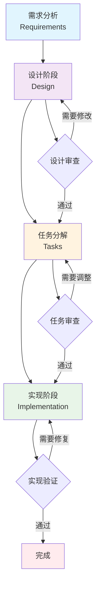
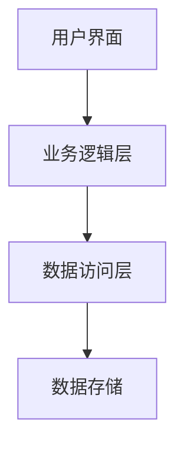
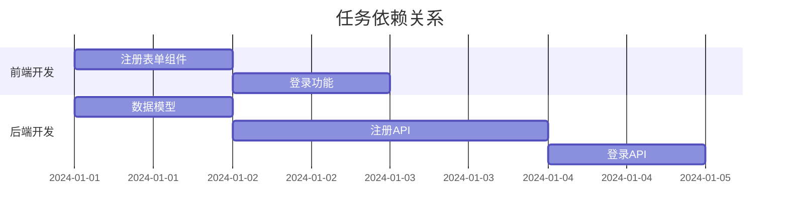

# 规格工作流程：Trae AI 功能开发

## 工作流程概览

### 🎯 **四阶段开发流程**


## 阶段一：需求分析 (Requirements)

### 📋 **目标**
- 明确功能需求和用户故事
- 定义验收标准和成功指标
- 识别技术约束和依赖关系

### 📝 **输入**
- 用户需求描述
- 业务背景和目标
- 现有系统约束

### 📄 **输出**
- `requirements.md` 文件
- 用户故事列表
- 验收标准定义
- 非功能性需求

### 🔄 **执行步骤**

#### 1. 创建需求文档
```bash
# 使用 Trae AI 创建功能目录
mkdir .trae/specs/[feature-name]

# 复制需求模板
cp .trae/templates/spec-template.md .trae/specs/[feature-name]/requirements.md
```

#### 2. 需求收集和分析
- **用户访谈**: 与用户或产品经理深入交流
- **竞品分析**: 研究类似功能的实现方式
- **技术调研**: 评估技术可行性和实现难度

#### 3. 编写用户故事
```markdown
## 用户故事

### 故事 1: [功能名称]
**作为** [用户角色]
**我希望** [功能描述]
**以便** [价值说明]

**验收标准:**
- [ ] 标准 1
- [ ] 标准 2
- [ ] 标准 3
```

#### 4. 定义验收标准
- **功能性标准**: 功能必须满足的具体要求
- **性能标准**: 响应时间、吞吐量等指标
- **可用性标准**: 用户体验和界面要求
- **安全性标准**: 安全和隐私保护要求

### ✅ **完成标准**
- [ ] 所有用户故事都有明确的验收标准
- [ ] 非功能性需求已识别和记录
- [ ] 技术约束和依赖关系已分析
- [ ] 需求文档已通过利益相关者审查

## 阶段二：设计阶段 (Design)

### 🎨 **目标**
- 设计技术架构和系统接口
- 定义数据模型和业务逻辑
- 制定实现策略和技术选型

### 📝 **输入**
- 已确认的需求文档
- 现有系统架构
- 技术栈和约束条件

### 📄 **输出**
- `design.md` 文件
- 架构设计图
- 接口定义
- 数据模型设计

### 🔄 **执行步骤**

#### 1. 架构设计
```markdown
## 系统架构

### 整体架构


### 组件设计
- **前端组件**: UI 组件和交互逻辑
- **后端服务**: API 接口和业务逻辑
- **数据层**: 数据模型和存储方案
```

#### 2. 接口设计
```typescript
// API 接口定义
interface UserService {
  createUser(userData: CreateUserRequest): Promise<User>;
  getUserById(id: string): Promise<User | null>;
  updateUser(id: string, updates: UpdateUserRequest): Promise<User>;
  deleteUser(id: string): Promise<boolean>;
}

// 数据模型定义
interface User {
  id: string;
  name: string;
  email: string;
  createdAt: Date;
  updatedAt: Date;
}
```

#### 3. 技术选型
- **前端技术**: React, Vue, Angular 等
- **后端技术**: Node.js, Python, Java 等
- **数据库**: MySQL, PostgreSQL, MongoDB 等
- **其他工具**: Redis, Docker, Kubernetes 等

#### 4. 风险评估
- **技术风险**: 新技术的学习成本和稳定性
- **性能风险**: 系统性能瓶颈和扩展性
- **安全风险**: 数据安全和隐私保护
- **集成风险**: 与现有系统的集成复杂度

### ✅ **完成标准**
- [ ] 架构设计清晰且符合需求
- [ ] 所有接口都有明确定义
- [ ] 数据模型设计合理
- [ ] 技术选型有充分理由
- [ ] 风险已识别并有应对方案

## 阶段三：任务分解 (Tasks)

### 📋 **目标**
- 将设计分解为具体的实现任务
- 估算工作量和时间安排
- 确定任务依赖关系和优先级

### 📝 **输入**
- 已确认的设计文档
- 开发团队能力评估
- 项目时间约束

### 📄 **输出**
- `tasks.md` 文件
- 详细任务列表
- 工作量估算
- 实现计划

### 🔄 **执行步骤**

#### 1. 任务识别
```markdown
## 实现任务

### 前端任务
- [ ] **T001**: 创建用户注册表单组件
  - **描述**: 实现用户注册的表单界面
  - **估算**: 4 小时
  - **依赖**: 无
  - **验收**: 表单验证正常，样式符合设计

- [ ] **T002**: 实现用户登录功能
  - **描述**: 用户登录逻辑和状态管理
  - **估算**: 6 小时
  - **依赖**: T001
  - **验收**: 登录成功后跳转到主页

### 后端任务
- [ ] **T003**: 创建用户数据模型
  - **描述**: 定义用户表结构和模型
  - **估算**: 2 小时
  - **依赖**: 无
  - **验收**: 数据库表创建成功

- [ ] **T004**: 实现用户注册 API
  - **描述**: 用户注册的后端接口
  - **估算**: 8 小时
  - **依赖**: T003
  - **验收**: API 测试通过
```

#### 2. 任务优先级排序
- **高优先级**: 核心功能和关键路径
- **中优先级**: 重要但非关键的功能
- **低优先级**: 优化和增强功能

#### 3. 依赖关系分析


#### 4. 工作量估算
- **乐观估算**: 最理想情况下的时间
- **悲观估算**: 最坏情况下的时间
- **最可能估算**: 最现实的时间估算
- **期望时间**: (乐观 + 4×最可能 + 悲观) / 6

### ✅ **完成标准**
- [ ] 所有任务都有明确的描述和验收标准
- [ ] 工作量估算合理且有依据
- [ ] 任务依赖关系清晰
- [ ] 实现计划可行且符合项目时间要求

## 阶段四：实现阶段 (Implementation)

### 💻 **目标**
- 按照任务计划执行具体实现
- 确保代码质量和测试覆盖
- 记录实现过程和遇到的问题

### 📝 **输入**
- 已确认的任务列表
- 设计文档和技术规范
- 开发环境和工具

### 📄 **输出**
- `implementation.md` 文件
- 实现的代码
- 测试用例和结果
- 部署文档

### 🔄 **执行步骤**

#### 1. 开发环境准备
```bash
# 创建开发分支
git checkout -b feature/[feature-name]

# 安装依赖
npm install

# 启动开发服务器
npm run dev
```

#### 2. 按任务实现功能
```markdown
## 实现记录

### 任务 T001: 创建用户注册表单组件
**状态**: ✅ 已完成
**实现时间**: 2024-01-01 09:00 - 13:00 (4小时)
**实际工作量**: 4小时 (符合估算)

**实现要点**:
- 使用 React Hook Form 进行表单管理
- 添加了实时验证功能
- 集成了 Material-UI 组件

**遇到的问题**:
- 表单验证规则需要调整
- 样式适配移动端需要额外工作

**解决方案**:
- 更新了验证规则配置
- 添加了响应式样式

**测试结果**:
- ✅ 单元测试通过 (覆盖率 95%)
- ✅ 集成测试通过
- ✅ 手动测试通过
```

#### 3. 代码审查
- **自我审查**: 检查代码质量和规范
- **同行审查**: 团队成员代码审查
- **自动化检查**: 使用工具进行静态分析

#### 4. 测试验证
```markdown
## 测试计划

### 单元测试
- [ ] 组件渲染测试
- [ ] 功能逻辑测试
- [ ] 边界条件测试

### 集成测试
- [ ] API 接口测试
- [ ] 数据库操作测试
- [ ] 端到端流程测试

### 性能测试
- [ ] 响应时间测试
- [ ] 并发负载测试
- [ ] 内存使用测试
```

#### 5. 部署和发布
```bash
# 构建生产版本
npm run build

# 运行测试
npm test

# 部署到测试环境
npm run deploy:staging

# 部署到生产环境
npm run deploy:production
```

### ✅ **完成标准**
- [ ] 所有任务都已完成并通过验收
- [ ] 代码质量符合团队标准
- [ ] 测试覆盖率达到要求
- [ ] 功能在生产环境正常运行
- [ ] 文档已更新

## 质量保证

### 🔍 **代码质量检查**
- **静态分析**: ESLint, SonarQube
- **代码格式**: Prettier, EditorConfig
- **类型检查**: TypeScript, Flow
- **安全扫描**: Snyk, OWASP

### 🧪 **测试策略**
- **测试金字塔**: 单元测试 > 集成测试 > E2E 测试
- **覆盖率要求**: 单元测试 ≥ 80%, 集成测试 ≥ 60%
- **自动化测试**: CI/CD 流水线集成
- **手动测试**: 用户验收测试

### 📊 **性能监控**
- **响应时间**: API 响应时间 < 200ms
- **页面加载**: 首屏加载时间 < 3s
- **资源使用**: CPU < 70%, 内存 < 80%
- **错误率**: 错误率 < 1%

## 最佳实践

### ✅ **开发实践**
1. **小步快跑**: 将大功能分解为小任务
2. **测试驱动**: 先写测试再写实现
3. **持续集成**: 频繁提交和集成代码
4. **代码审查**: 所有代码都要经过审查

### 📝 **文档实践**
1. **及时更新**: 代码变更时同步更新文档
2. **清晰描述**: 使用简洁明了的语言
3. **示例代码**: 提供具体的使用示例
4. **版本控制**: 文档也要纳入版本控制

### 🔄 **流程实践**
1. **严格执行**: 严格按照定义的流程执行
2. **持续改进**: 基于实践经验优化流程
3. **团队协作**: 确保团队成员理解流程
4. **工具支持**: 使用工具自动化流程

## 常见问题和解决方案

### ❓ **需求变更**
**问题**: 开发过程中需求发生变更
**解决方案**:
1. 评估变更影响范围
2. 更新相关文档
3. 调整任务计划
4. 重新进行风险评估

### ❓ **技术难题**
**问题**: 遇到技术实现困难
**解决方案**:
1. 深入研究技术文档
2. 寻求团队成员帮助
3. 考虑替代技术方案
4. 必要时调整设计

### ❓ **时间延期**
**问题**: 实际开发时间超出估算
**解决方案**:
1. 分析延期原因
2. 重新评估剩余工作量
3. 调整项目计划
4. 考虑增加资源或调整范围

### ❓ **质量问题**
**问题**: 代码质量或测试覆盖率不达标
**解决方案**:
1. 进行代码重构
2. 补充测试用例
3. 加强代码审查
4. 提供技术培训

## 工具和资源

### 🛠️ **推荐工具**
- **项目管理**: Jira, Trello, Asana
- **代码托管**: GitHub, GitLab, Bitbucket
- **CI/CD**: Jenkins, GitHub Actions, GitLab CI
- **测试工具**: Jest, Cypress, Selenium
- **监控工具**: Sentry, DataDog, New Relic

### 📚 **参考资源**
- **设计模式**: Gang of Four 设计模式
- **架构指南**: Clean Architecture, Microservices
- **测试指南**: Test-Driven Development
- **代码规范**: Google Style Guide, Airbnb Style Guide

### 🎓 **学习资源**
- **在线课程**: Coursera, Udemy, Pluralsight
- **技术博客**: Medium, Dev.to, InfoQ
- **开源项目**: GitHub, GitLab
- **技术社区**: Stack Overflow, Reddit